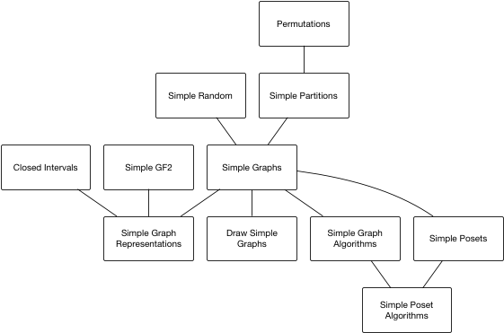

# SimpleWorld

## Welcome

This is a starting point for my collection of Julia modules for
graph theory computing (and related topics) available on
github at https://github.com/scheinerman.

Here is a brief overview of my modules:

### Graph Theory modules

+ `SimpleGraphs`: Defines the `SimpleGraph` and
  `SimpleDigraph` types together with a variety of constructors,
  functions for manipulating the graphs (e.g. adding/deleting
  vertices/edges), and functions to ascertain properties of these
  graphs (such as shortest paths between given vertices).
+ `SimpleGraphDrawings`: Provides the `SimpleGraphDrawing` type that
  wraps around a `SimpleGraph` and functions for drawing/visualizing
  graphs.
+ `SimpleGraphAlgorithms`: Additional functions whose operation relies
  on integer linear programming.
+ `SimpleGraphRepresentations`: Intersection graphs and the like.

### Paritally ordered set modules

+ `SimplePosets`: Provides the `SimplePoset` type for working with
  partially ordered sets.
+ `SimplePosetAlgorithms`: Additional functions for the `SimplePoset`
  type. These functions rely on integer linear programming.

### Other useful modules

These are useful in their own right and some of the `Simple`
modules rely on them:
+ `SimpleGF2`: Defines the `GF2` type which represents an element
from the finite field GF(2); that is, the mod 2 field consisting
of just the numbers 0 and 1. This package includes standard
arithmetic and extensions for matrices.
+ `SimplePartitions`: Work with set partitions.
+ `BigCombinatorics`: Counting functions.
+ `SimpleRandom`: Create random things.
+ `ClosedIntervals`: Defines the `ClosedInterval` data type
that represent closed intervals of real numbers (or integers).
Includes some basic functions and operations on closed intervals.
+ `Permutations`: Defines the `Permutation` data type and
functions/operations for dealing with permutations of
finite sets of the form {1,2,...,n}.
+ `SimplePartitions`: Partitions of finite sets.
+ `Counters`: Count things.
+ `Multisets`: Unordered finite collections with repetition allowed.
+ `RingLists`: Lists that wrap around.
+ `ShowSet`: Loading this module overrides the usual way Julia
displays sets. The usual way Julia displays a `Set` (or `IntSet`)
looks like this:
```julia
julia> A = Set([1,2,3])
Set([2,3,1])
```
After `using ShowSet` it looks like this:
```julia
julia> A = Set([1,2,3])
{1,2,3}
```
+ `SimpleTools`: Miscellaneous, useful functions that don't have
a natural home.
+ `SimpleTropical`: An implementation of tropical (min-plus) arithmetic.

### Dependencies


The following diagram illustrates how my primary modules depend on one another.



## Loading the `Simple` modules


This repository provides the function `SimpleFavorites` that loads
all my favorite graph theory (and related) packages.

When Julia starts up, we just have to give the command `SimpleFavorites()`
and we see the packages as they get loaded.


## Supporting function

The `SimpleFavorites` function depends on `SimplePackageLoader`. In a sense
this function behaves like the `using` command in Julia. Instead of
`using PackageName` one may, instead, invoke
`SimplePackageLoader("PackageName")`. An optional second argument
(called `verbose`) controls if an informational message is printed.

`SimplePackageLoader` may also be called with a 1-dimensional array
(i.e., a list) of package names.
