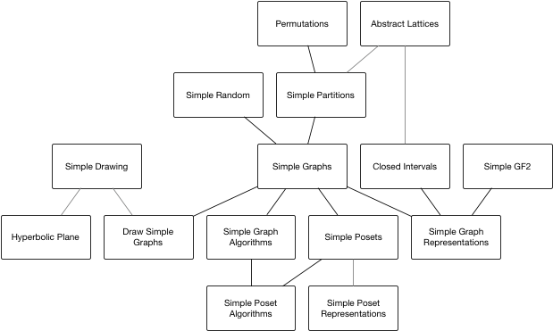

# SimpleWorld

## Welcome

This is a starting point for my collection of Julia modules for
graph theory computing (and related topics) available on
github at https://github.com/scheinerman.

Here is a brief overview of my modules:

### Graph Theory modules

+ `SimpleGraphs`: Defines the `SimpleGraph` and
  `SimpleDigraph` types together with a variety of constructors,
  functions for manipulating the graphs (e.g. adding/deleting
  vertices/edges), and functions to ascertain properties of these
  graphs (such as shortest paths between given vertices).
+ `DrawSimpleGraphs`: Provides a `draw` function to visualize graphs. (Replaces `SimpleGraphDrawings`.)
+ `SimpleGraphAlgorithms`: Additional functions whose operation relies
  on integer linear programming.
+ `SimpleGraphRepresentations`: Intersection graphs and the like.

### Paritally ordered set modules

+ `SimplePosets`: Provides the `SimplePoset` type for working with
  partially ordered sets.
+ `SimplePosetAlgorithms`: Additional functions for the `SimplePoset`
  type. These functions rely on integer linear programming.

### Other useful modules

These are useful in their own right and some of the `Simple`
modules rely on them:
+ `SimpleGF2`: Defines the `GF2` type which represents an element
from the finite field GF(2); that is, the mod 2 field consisting
of just the numbers 0 and 1. This package includes standard
arithmetic and extensions for matrices.
+ `SimplePartitions`: Work with set partitions.
+ `BigCombinatorics`: Counting functions.
+ `SimpleRandom`: Create random things.
+ `SimpleDrawing`: Extension to `Plots` for line segments, arcs of circles, etc.
+ `ClosedIntervals`: Defines the `ClosedInterval` data type
that represent closed intervals of real numbers (or integers).
Includes some basic functions and operations on closed intervals.
+ `Permutations`: Defines the `Permutation` data type and
functions/operations for dealing with permutations of
finite sets of the form {1,2,...,n}.
+ `SimplePartitions`: Partitions of finite sets.
+ `HyperbolicPlane`: Work in the Poincaré disk model.
+ `Counters`: Count things.
+ `Multisets`: Unordered finite collections with repetition allowed.
+ `RingLists`: Lists that wrap around.
+ `ShowSet`: Loading this module overrides the usual way Julia
displays sets. The usual way Julia displays a `Set` (or `IntSet`)
looks like this:
```
julia> A = Set([1,2,3])
Set([2,3,1])
```
After `using ShowSet` it looks like this:
```
julia> A = Set([1,2,3])
{1,2,3}
```
+ `SimpleTools`: Miscellaneous, useful functions that don't have
a natural home.
+ `SimpleTropical`: An implementation of tropical (min-plus) arithmetic.

### Dependencies


The following diagram illustrates how my primary modules depend on one another.



## Loading my favorite  modules

The `src` directory contains a `startup.jl` file that can be installed
easily with the `install.sh` script (also in `src`). The shell script copies
`starup.jl` to `~/.julia/config/startup.jl`. After launching Julia, the
function `SimpleFavorites()` will execute a series of `using ...` commands.
(The list of packages loaded may vary based on my personal preferences.)
```
$ julia
┌─────────────────────────────────────────────────┐
│ Use SimpleFavorites() to load standard packages │
└─────────────────────────────────────────────────┘
               _
   _       _ _(_)_     |  Documentation: https://docs.julialang.org
  (_)     | (_) (_)    |
   _ _   _| |_  __ _   |  Type "?" for help, "]?" for Pkg help.
  | | | | | | |/ _` |  |
  | | |_| | | | (_| |  |  Version 1.0.0 (2018-08-08)
 _/ |\__'_|_|_|\__'_|  |  Official https://julialang.org/ release
|__/                   |

julia> SimpleFavorites()
[ Info: using Permutations
[ Info: using SimplePartitions
[ Info: using SimpleGraphs
[ Info: using BigCombinatorics
[ Info: using Polynomials
[ Info: using SimpleGF2
[ Info: using ShowSet
[ Info: using Primes
[ Info: using SimpleRandom
[ Info: using Multisets
[ Info: using Counters

julia>
```

## Erasing and starting over

From time to time, I have found it useful to utterly wipe out my `~/.julia`
directory and start over. The file `src/Rebuild-All-Packages.jl` contains
the function `load_all()` to fetch all my favorite stuff from GitHub and
repopulate my `~/.julia`.

Alternatively, I can do this:
```
pkg> dev https://github.com/scheinerman/SimpleWorld.jl.git

julia> using SimpleWorld

julia> load_all()
```
